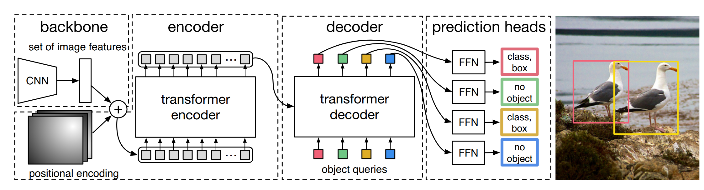

# DETR (DEtection TRansformer)

> DETR 是 Facebook Research 在 2020 年提出的目标检测模型，首次将 Transformer 架构引入目标检测领域，摒弃了传统检测器中手工设计的 NMS、Anchor 等组件，实现了一个真正端到端的检测 pipeline。

---

## 一、DETR 的核心思想

传统目标检测器（Faster R-CNN、YOLO 等）依赖大量人工先验：anchor 设计、NMS 后处理、RoI 池化等。DETR 将这些组件全部替换为 **Transformer + 集合预测**，把目标检测建模成一个**二分图匹配问题**：

- **Encoder** 将图像特征编码为全局上下文
- **Decoder** 用 100 个可学习的 object queries 并行解码出 100 个检测结果
- **匈牙利算法** 在预测集和 GT 集之间做 1 对 1 匹配
- 匹配上的预测计算分类 + 回归损失，未匹配的归为 "no object"

---




## 二、整体 Pipeline 流程

```
输入图像 (PIL + COCO 标注)
  │
  ├─ [1] 数据预处理 (Transforms)
  │     ├─ RandomResize / RandomCrop / RandomFlip
  │     ├─ ToTensor + Normalize
  │     ├─ boxes: xyxy → cxcywh + 归一化到 [0, 1]
  │     └─ batch padding + mask 生成
  │
  ├─ [2] 模型前向 (DETR.forward)
  │     ├─ Backbone (ResNet-50) → 特征图 [B, 2048, H/32, W/32]
  │     ├─ Position Embedding (正弦编码) → [B, 256, H/32, W/32]
  │     ├─ 1×1 Conv 降维 → [B, 256, H/32, W/32]
  │     ├─ Transformer Encoder (6 层)
  │     │     └─ Self-Attn + FFN, 输出 memory
  │     ├─ Transformer Decoder (6 层)
  │     │     └─ Self-Attn + Cross-Attn + FFN, 输出 [6, B, 100, 256]
  │     ├─ class_embed: Linear(256, num_classes+1) → 分类 logits
  │     └─ bbox_embed: MLP(256→256→4) → sigmoid → cxcywh ∈ [0,1]
  │
  ├─ [3] 匈牙利匹配 (HungarianMatcher)
  │     ├─ 代价矩阵: C = 5×L1_cost + 1×CLS_cost + 2×GIoU_cost
  │     └─ scipy.linear_sum_assignment → 1 对 1 匹配
  │
  ├─ [4] 损失计算 (SetCriterion)
  │     ├─ L_ce: CrossEntropy(所有 100 个预测), no-object 类权重 0.1
  │     ├─ L_bbox: L1 Loss (仅匹配上的预测)
  │     ├─ L_giou: GIoU Loss (仅匹配上的预测)
  │     └─ 辅助损失: 每层 decoder 独立匹配 + 计算
  │
  └─ [5] 反向传播 + 梯度裁剪 + AdamW 优化
```

---

## 三、数据预处理

数据从 COCO 格式到模型输入经历了以下转换：

### 3.1 标注格式转换 (`ConvertCocoPolysToMask`)

```python
# COCO 原始 bbox: [x, y, w, h] (绝对坐标, 左上角+宽高)
# 转换后:
target = {
    'boxes':   [N, 4]  # [x1, y1, x2, y2] 绝对坐标
    'labels':  [N]     # category_id
    'image_id': [1]
    'orig_size': [H, W]  # 原始图像尺寸
}
```

### 3.2 数据增强

训练时的 transforms 顺序：

```python
T.RandomHorizontalFlip()        # 50% 概率水平翻转
T.RandomSelect(
    T.RandomResize(scales),     # 50%: 仅缩放 (短边 ∈ [480,800], 长边 ≤ 1333)
    T.Compose([                 # 50%: 缩放+裁剪+缩放
        T.RandomResize([400,500,600]),
        T.RandomSizeCrop(384,600),
        T.RandomResize(scales),
    ])
)
T.ToTensor()                    # PIL → Tensor [0,1]
T.Normalize(mean, std)          # 标准化 + 关键转换↓↓↓
```

### 3.3 Normalize 中的关键操作

`Normalize` 在标准化图像的同时，完成了 boxes 的**两次关键转换** (`datasets/transforms.py:242`):

```python
boxes = box_xyxy_to_cxcywh(boxes)    # [x1,y1,x2,y2] → [cx,cy,w,h]
boxes = boxes / [w, h, w, h]         # 归一化到 [0,1]
```

> 这里 DETR 决定使用 **(cx, cy, w, h) 归一化坐标** 作为框的表示形式，且所有后续操作（匹配、损失、预测）都基于此格式。

### 3.4 Batch 组装

```python
# collate_fn → nested_tensor_from_tensor_list
# 将不同尺寸的图像 pad 到 batch 中最大尺寸
# 生成 mask: True = 填充区域（需要忽略）

samples = NestedTensor(
    tensor=[B, 3, H_max, W_max],   # pad 后的图像
    mask=[B, H_max, W_max]          # 填充位置为 True
)
```

---

## 四、模型前向传播

### 4.1 Backbone + Position Encoding

```python
features, pos = self.backbone(samples)  # Joiner(Backbone, PositionEmbedding)
```

**Backbone (ResNet-50):**
- 使用 `FrozenBatchNorm2d`（固定 BN 统计量）
- `IntermediateLayerGetter` 截取 `layer4` 输出
- 输出特征图: `[B, 2048, H/32, W/32]`
- mask 也从原图插值到相同尺寸

**PositionEmbeddingSine:**
```python
# 对每个位置计算行列累计值
y_embed = mask_not.cumsum(1)  # 行方向累积
x_embed = mask_not.cumsum(2)  # 列方向累积

# 不同频率的 sin/cos 编码
pos_x = sin/cos(x_embed / temperature^(2i/d))
pos_y = sin/cos(y_embed / temperature^(2i/d))

# 输出: [B, 256, H/32, W/32]
# y 方向 128 维 + x 方向 128 维 = 256 维
```

不使用 `normalize=True` 时对 mask 区域做归一化，使得位置编码对图像尺寸不变。

### 4.2 Transformer

#### 输入准备
```python
src = self.input_proj(src)           # Conv2d(2048, 256, 1×1)
src = src.flatten(2).permute(2,0,1)  # [B,256,H,W] → [HW, B, 256]
pos = pos_embed.flatten(2).permute(2,0,1)
mask = mask.flatten(1)               # [B, HW]
tgt = torch.zeros(100, B, 256)       # object queries 初始化为零
```

#### Encoder (6 层)

每层的计算 (`TransformerEncoderLayer.forward_post`):

```python
# 1. Self-Attention
q = k = src + pos              # Query/Key 加上位置编码
attn_out = MultiheadAttention(q, k, value=src,
                               key_padding_mask=mask)   # 屏蔽填充位置
src = LayerNorm(src + dropout(attn_out))

# 2. FFN
ffn_out = Linear2(ReLU(Dropout(Linear1(src))))   # 256→2048→256
src = LayerNorm(src + dropout(ffn_out))
```

输出 `memory`: **[HW, B, 256]** — 融合了全局上下文的图像特征。

#### Decoder (6 层)

##### 数据流概览

Decoder 的输入包含四类张量，它们的角色和生命周期各不相同：

```python
# Transformer.forward (transformer.py:47-58)
def forward(self, src, mask, query_embed, pos_embed):
    bs, c, h, w = src.shape

    memory    = self.encoder(src, mask, pos_embed)              # [HW, B, 256]
    pos       = pos_embed.flatten(2).permute(2, 0, 1)           # [HW, B, 256]
    query_pos = query_embed.unsqueeze(1).repeat(1, bs, 1)       # [100, B, 256]
    tgt       = torch.zeros_like(query_pos)                     # [100, B, 256]
```

| 张量 | Shape | 语义 | 来源 | 更新 |
|------|-------|------|------|------|
| `memory` | [HW, B, 256] | 编码后的图像全局特征 | Encoder 输出 | 否 |
| `pos` | [HW, B, 256] | 图像空间位置编码 | 正弦编码 | 否 |
| `query_pos` | [100, B, 256] | 可学习的 object query 身份 | `nn.Embedding(100, 256)` | 否（前向不变；反向通过梯度更新参数） |
| `tgt` | [100, B, 256] | querys 的内容表示 | 全零初始化 | **逐层更新** |

> `tgt` 初始化为全零是因为每个 query 的"身份"（检索条件）完全由 `query_pos` 提供，"内容"（检索积累）随着每层从 `memory` 中提取信息而逐步填充。`query_pos` 在 6 层 decoder 中**共享且不随层变化**——它的作用是在每一层提供稳定的检索身份，其参数值通过反向传播在整个训练过程中逐步学习。

---

##### 单层结构 (DecoderLayer)

每层按顺序包含三个子模块，各有不同的信息交互范围：

```
   tgt [100, B, 256]  ──── ① Self-Attention ──── Add & Norm ──┐
  (query 内部表示)      (query×query 交互)                       │
                                                                 ├── ② Cross-Attention ── Add & Norm ──┐
  memory [HW, B, 256]  ─────────────────────────────────────────┘   (query×image 交互)                  │
                                                                                                         ├── ③ FFN ── Add & Norm
  query_pos ─────────────────────────────────────────────────────────────────────────────────────────────┘   (逐位置变换)
  pos       ─────────────────────────────────────────────────────────────────────────────────────────────┘
```

> 三种交互范围的本质区别：Self-Attention 在 **query 集合内部**做信息交换；Cross-Attention 在 **query 与图像特征之间**做跨模态检索；FFN 在**每个 query 内部**做非线性变换。

---

##### ① Self-Attention — query 间交互

**源码** :

```python
q = k = tgt + query_pos            # Q = K = 内容 + 身份
v = tgt                            # V = 纯内容
tgt2 = self.self_attn(q, k, v)[0]
tgt = LayerNorm(tgt + dropout(tgt2))
```

**计算过程**:

```
Attention(Q, K, V) = softmax( Q·K^T / √d_k ) · V

其中 Q, K ∈ R^{100×256}, Q·K^T ∈ R^{100×100}
```

- **Score**: 100×100 矩阵，`S[i][j]` 表示 query_i 的 Q 与 query_j 的 K 的点积相似度
- **Attention weights**: 经 softmax 归一化后，`A[i][j]` 是 query_i 对 query_j 的关注权重
- **Output**: `O[i] = Σ_j A[i][j] · V[j]`，query_i 的输出是所有 query_j 的 V 的加权混合

**设计意图**: DETR 同时输出全部 100 个检测结果。Self-Attention 提供了 **信息交互通道**，使每个 query 在执行 Cross-Attention 之前能够感知其他 query 的状态，避免多个 query 聚焦同一目标区域——这等价于一种**隐式的去重机制**，替代了传统检测器中 NMS 后处理的功能。

---

##### ② Cross-Attention — query 从图像特征中检索信息

**源码**:

```python
tgt2 = self.multihead_attn(
    query = tgt + query_pos,              # Q: query 的意图
    key   = memory + pos,                 # K: 图像特征 + 空间位置
    value = memory,                       # V: 纯视觉内容
    key_padding_mask = mask               # 屏蔽 padding 区域
)[0]
tgt = LayerNorm(tgt + dropout(tgt2))
```

**计算过程**:

```
Attention(Q, K, V) = softmax( Q·K^T / √d_k ) · V

Q ∈ R^{100×256}, K, V ∈ R^{HW×256}, Q·K^T ∈ R^{100×HW}
```

- **Score**: 100×HW 矩阵，`S[i][j]` 表示 query_i 对图像位置 j 的匹配程度
- **Attention weights**: 经 softmax 后，每行对 HW 个位置形成概率分布
- **Output**: `O[i] = Σ_j A[i][j] · V[j]`，query_i 的输出是对所有图像位置 V 的加权聚合

**Q/K/V 的语义**:

| | Q (query) | K (key) | V (value) |
|---|---|---|---|
| **组成** | `tgt + query_pos` | `memory + pos` | `memory` |
| **角色** | "我要检索什么" | "我提供了什么可被检索的" | "检索到后提取什么内容" |
| **位置信息** | query_pos (可学习) | pos (正弦编码) | — |

一个关键设计: **V 不加位置编码**。原因是 attention 的输出将被用作 query 特征更新的增量，应当只包含视觉语义信息。若 V 混入 pos，则位置坐标会通过残差连接"污染"后续层的 query 表示。

**与 Encoder Self-Attention 的对比**:

```
Encoder Self-Attn: K = Q (同源),   交互范围: image ↔ image
Decoder Cross-Attn: K ≠ Q (异源),  交互范围: query  ↔ image
```

---

##### ③ FFN — 逐位置特征变换

**源码**:

```python
tgt2 = Linear(2048)( ReLU( Dropout( Linear(256)(tgt) ) ) )
tgt = LayerNorm(tgt + dropout(tgt2))
```

两层全连接，隐层维度 2048。FFN 对 100 个 query **独立作用**（参数共享但 query 间无交互），将 Cross-Attention 聚合到的跨模态信息做非线性变换和特征整合。

---

##### 残差结构

每层的三个子模块均采用 Pre-Norm 或 Post-Norm 的残差连接模式。以 Post-Norm（DETR 默认）为例：

```
output = LayerNorm( input + Dropout( SubLayer(input) ) )
```

残差连接为梯度提供了不经注意力和 FFN 变换的直通路径，使 6 层堆叠在训练中不会出现梯度消失。

---

##### 6 层堆叠与中间监督

```python
# TransformerDecoder.forward (transformer.py:95-123)
output = tgt                            # [100, B, 256] 全零
intermediate = []

for layer in self.layers:               # 6 个参数独立的 DecoderLayer
    output = layer(output, memory, pos=pos, query_pos=query_pos)
    if self.return_intermediate:
        intermediate.append(self.norm(output))

hs = torch.stack(intermediate)          # [6, 100, B, 256]
```

`return_intermediate=True` 时返回全部 6 层的输出。最后一层作为主预测，前 5 层作为辅助输出（aux_outputs），每层独立进行匈牙利匹配并计算相同的监督损失，实现**深层监督**（deep supervision），加速训练收敛。

---

##### query 演化的阶段性特征

6 层 Decoder 堆叠的效果可以从 query 表示的演化来理解：

```
Layer 0: tgt = 0, Cross-Attn 初次从 memory 中检索
         → 形成对物体位置的初步感知（粗糙的热力图）

Layer 1: Self-Attn 开始形成差异化（query 之间协商分工）
         → Cross-Attn 聚焦更精确，query 表示开始分化

Layers 2-4: Self-Attn 维持分工一致性
            → Cross-Attn 进一步细化定位
            → FFN 逐步提取出对分类和回归有用的特征

Layer 5: query 表示达到最终质量
         → 可直接由 class_embed / bbox_embed 映射为检测结果
```

---

##### 与自回归 Transformer Decoder 的本质区别

DETR Decoder 不使用 `tgt_mask`（因果注意力掩码）。这意味着:

```
自回归 (GPT 等):                   DETR:
                    tgt_mask
q₀ ← q₀              [1,0,0]       q₀ ─┐
q₁ ← q₀,q₁           [1,1,0]       q₁ ─┤
q₂ ← q₀,q₁,q₂        [1,1,1]       q₂ ─┼── 全部并行，双向可见
...                                  ... │
                                     q₉₉ ─┘
```

100 个 query **同时、并行、完全可见**，不依赖时序顺序。这使得 DETR 无需自回归地逐个生成检测结果，一次前向即可得到全部预测。

##### Self-Attention 的隐式去重机制

传统检测器依赖 NMS 抑制冗余框，而 DETR 中这一功能由 Self-Attention 隐式完成。Self-Attention 使 query_i 能够感知 query_j 的当前状态——包括其 query_pos 提供的位置偏好和 `tgt` 中积累的语义信息——从而主动调节自身行为以避免重叠。这一机制的有效性不需要额外的损失项来保证：匈牙利匹配的 1-to-1 分配压力自然促使 query 之间形成差异化。

### 4.3 预测头

> Decoder 输出的 100 个 256 维向量已经包含了所有需要的检测信息。现在只需要两个线性层将它翻译成"类别"和"坐标"。

```python
hs = hs.transpose(1, 2)              # [6, B, 100, 256]

# 分类头: 每个 query 预测 num_classes+1 个类
# 最后一个是 "no object" 类
outputs_class = self.class_embed(hs)  # Linear(256, num_classes+1)
# → [6, B, 100, num_classes+1]

# 框回归头: 3层 MLP, 输出 sigmoid 确保在 [0,1]
outputs_coord = self.bbox_embed(hs).sigmoid()
# → [6, B, 100, 4]  (cx, cy, w, h)
```

```python
out = {
    'pred_logits': outputs_class[-1],   # 最后一层 → 主输出
    'pred_boxes':  outputs_coord[-1],
}
if aux_loss:
    out['aux_outputs'] = [             # 前 5 层 → 辅助输出
        {'pred_logits': ..., 'pred_boxes': ...} for i in range(5)
    ]
```

---

## 五、匈牙利匹配

DETR 的核心创新之一：用**二分图最优匹配**替代 anchor → IoU → NMS 的手工流程。

### 5.1 代价矩阵构建

```python
# 展平 batch 维度方便计算
out_prob = outputs["pred_logits"].flatten(0,1).softmax(-1)  # [B×100, num_classes+1]
out_bbox = outputs["pred_boxes"].flatten(0,1)                # [B×100, 4]
tgt_ids  = concat(targets["labels"])                         # [total_gt]
tgt_bbox = concat(targets["boxes"])                          # [total_gt, 4]
```

三种代价:

| 代价 | 公式 | 含义 |
|------|------|------|
| 分类代价 | `C_cls = -out_prob[:, tgt_ids]` | 预测越确信真实类，代价越小 |
| L1 代价 | `C_bbox = ∥out_bbox - tgt_bbox∥₁` | 框坐标的 L1 距离 |
| GIoU 代价 | `C_giou = -GIoU(out, tgt)` | 框重叠度（GIoU 越高代价越小） |

```python
C = 5 × C_bbox + 1 × C_cls + 2 × C_giou       # 默认权重
```

### 5.2 最优匹配

```python
# 对每张图片独立求解
C = C.view(B, 100, -1)                         # 恢复 batch 维度
sizes = [len(t["boxes"]) for t in targets]
indices = [linear_sum_assignment(c[i])          # scipy 匈牙利算法
           for i, c in enumerate(C.split(sizes, -1))]

# 返回: [(pred_idx, tgt_idx), ...]  每个元素对应一张图的匹配对
```

> 匈牙利算法保证找到**全局代价最小**的二分图匹配，复杂度 O(n³)。

---

## 六、损失计算

### 6.1 总损失公式

```
L_total = λ_ce × L_ce + λ_bbox × L_bbox + λ_giou × L_giou
        = 1 × L_ce   +   5 × L_bbox  +   2 × L_giou
```

### 6.2 分类损失 (`loss_labels`)

```python
# 构建 target: 所有 100 个预测初始化为 no-object 类
target_classes = torch.full((B, 100), num_classes)     # 全部 = no-object

# 匹配到的位置填入真实类别
idx = (batch_idx, src_idx)   # 提取匹配到的预测索引
target_classes[idx] = matched_target_classes

# CrossEntropy 作用于全部 100 个预测
loss_ce = CrossEntropy(pred_logits, target_classes, weight=empty_weight)
```

**no-object 权重处理**: `empty_weight[-1] = eos_coef = 0.1`

> 因为负样本远多于正样本（100 个预测中通常只有几个匹配到），给 no-object 类降权防止分类器过于偏向预测背景。

### 6.3 框回归损失 (`loss_boxes`)

```python
# 只取匹配到的预测
src_boxes = pred_boxes[idx]          # [num_matched, 4]
tgt_boxes = concat(tgt_boxes[idx])   # [num_matched, 4]

# L1 回归损失
loss_bbox = L1Loss(src_boxes, tgt_boxes).sum() / num_boxes

# GIoU 损失 (1 - GIoU 的均值)
# 先转回 xyxy 格式才能计算 GIoU
loss_giou = (1 - GIoU(cxcywh→xyxy(src_boxes),
                       cxcywh→xyxy(tgt_boxes)).diag()).sum() / num_boxes
```

`num_boxes` 归一化: 分布式训练时所有 GPU 的 GT 数量 all_reduce 后取平均，确保每张卡梯度尺度一致。

### 6.4 辅助损失 (Auxiliary Loss)

```python
if 'aux_outputs' in outputs:
    for i, aux in enumerate(outputs['aux_outputs']):  # 遍历前 5 层
        indices = self.matcher(aux, targets)           # 每层独立匹配!
        # 计算相同损失，key 加后缀 _0, _1, _2, _3, _4
```

| 属性 | 主损失 | 辅助损失 |
|------|--------|---------|
| 数据来源 | Decoder 最后一层 | Decoder 前 5 层 |
| 匹配方式 | 匈牙利匹配 | 每层独立匹配 |
| 权重 | λ (1/5/2) | 相同权重 |
| 作用 | 最终输出监督 | 加速收敛, 深层监督 |

---

## 七、训练流程 
### 7.1 一次训练迭代

```python
# engine.py: train_one_epoch
for samples, targets in data_loader:
    samples = samples.to(device)
    targets = [{k: v.to(device) for k, v in t.items()} for t in targets]

    outputs = model(samples)                          # 前向
    loss_dict = criterion(outputs, targets)            # 损失
    losses = sum(loss_dict[k] * weight_dict[k])        # 加权求和

    losses.backward()                                  # 反向

    clip_grad_norm_(model.parameters(), max_norm=0.1)  # 梯度裁剪
    optimizer.step()                                   # 参数更新
```

### 7.2 训练配置速查

| 超参数 | 值 | 说明 |
|--------|-----|------|
| 优化器 | AdamW | lr=1e-4, backbone lr=1e-5 |
| 权重衰减 | 1e-4 | |
| 梯度裁剪 | 0.1 | max_norm |
| LR 调度 | StepLR | epoch 200 衰减 |
| 总 epochs | 300 | |
| Batch size | 2 (默认) | 单卡 |
| num_queries | 100 | 每次最多检测 100 个物体 |
| d_model | 256 | Transformer 隐层维度 |
| Encoder 层数 | 6 | |
| Decoder 层数 | 6 | |
| 注意力头数 | 8 | |
| FFN 隐层 | 2048 | |
| dropout | 0.1 | |

---

## 八、维度变化速查表

| 阶段 | 张量形状 | 说明 |
|------|---------|------|
| 原始图像 | [H, W, 3] | PIL Image |
| 预处理后 | [B, 3, H_pad, W_pad] | pad 到同尺寸 |
| Backbone 输出 | [B, 2048, H/32, W/32] | ResNet-50 layer4 |
| input_proj 后 | [B, 256, H/32, W/32] | 1×1 conv 降维 |
| Encoder 输入 | [H/32×W/32, B, 256] | 展平为序列 |
| Position Embedding | [B, 256, H/32, W/32] | sin/cos 编码 |
| Query Embedding | [100, B, 256] | 可学习的 N 个查询 |
| Decoder 输出 | **[6, B, 100, 256]** | 6 层全部输出 |
| pred_logits | [6, B, 100, num_classes+1] | 含 no-object 类 |
| pred_boxes | [6, B, 100, 4] | cx, cy, w, h ∈ [0,1] |
| 匹配代价矩阵 | [B, 100, total_gt] | 匈牙利算法输入 |
| 损失标量 | 单个 float | 加权求和结果 |

---

## 九、DETR 的设计亮点

1. **端到端，无手工组件**: 没有 anchor、没有 NMS、没有 RoI pooling，整个 pipeline 只用 NN 模块搭建

2. **集合预测**: 固定输出 100 个预测结果，用匈牙利匹配解决标签分配，摆脱了传统 one-to-many 匹配 + NMS 的流程

3. **全局上下文**: Transformer 的自注意力机制让每个检测框都能利用整张图的信息，天然适合处理遮挡、大物体等场景

4. **并行解码**: Decoder 一次性输出全部 100 个结果，不像自回归模型需要逐个生成

5. **深层监督**: 辅助损失让每个 decoder 层都能直接接收监督信号，加速收敛

## 十、局限性

- 小物体检测性能较差（Transformer 缺少多尺度特征）
- 训练收敛慢（需要 300 epochs vs 传统方法的 12-36 epochs）
- 需要大量训练数据

> 后续工作 **Deformable DETR** 通过可变形注意力解决了收敛慢和多尺度问题，大幅提升了小物体检测性能。


