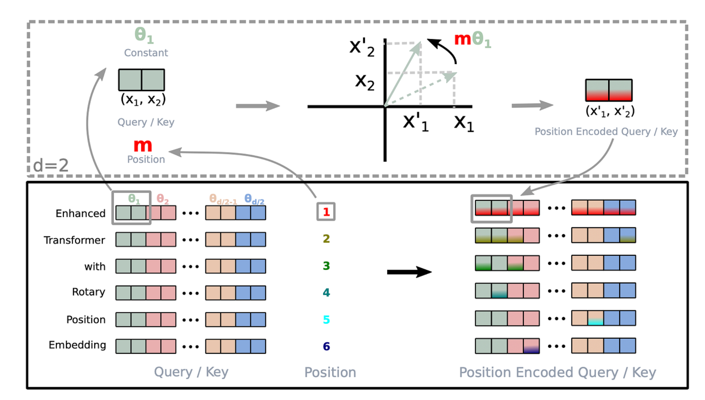

# RoPE：旋转位置编码

Transformer 的自注意力机制并行处理整个序列，矩阵乘法本身是**位置无关**的——打乱输入顺序，输出也只是相应打乱。为了让模型理解"谁在前、谁在后"，必须注入位置信息。

## 位置编码的演进

```
绝对位置编码 (GPT-1/2)     →  学习固定位置向量，直接加到 embedding
正弦位置编码 (Transformer)  →  用 sin/cos 生成位置向量，加到 embedding
相对位置编码 (T5, ALiBi)    →  在 attention 分数上加偏置
RoPE (LLaMA, Qwen, ...)   →  旋转 Q 和 K 向量 ← 现代主流
```

**绝对位置编码**的痛点：模型难以泛化到训练时没见过的长度；相对位置关系只能靠模型从绝对编码中"悟出来"。

**RoPE 的思路**：把位置信息"旋转"进 Q 和 K 向量中，使得两个位置的向量点积天然包含它们的**相对距离**。



---

## 数学原理：二维旋转

### 旋转矩阵

二维空间中，绕原点旋转 $\theta$ 的旋转矩阵是：

$$
R(\theta) = \begin{bmatrix} \cos\theta & -\sin\theta \\ \sin\theta & \cos\theta \end{bmatrix}
$$

对向量 $x = \begin{bmatrix} x_0 \\ x_1 \end{bmatrix}$ 施加旋转：

$$
R(\theta) \cdot x = \begin{bmatrix} x_0\cos\theta - x_1\sin\theta \\ x_0\sin\theta + x_1\cos\theta \end{bmatrix}
$$

### 用复数理解

旋转等价于乘以 $e^{i\theta}$：

$$
(x_0 + i \cdot x_1) \cdot e^{i\theta} = (x_0 + i \cdot x_1) \cdot (\cos\theta + i \cdot \sin\theta)
$$

展开后实部和虚部分别对应旋转后的两个坐标，与矩阵形式完全一样。

### 为什么旋转能编码相对位置

旋转矩阵有一个关键性质——**正交性**：

$$
R(\theta_1)^\top \cdot R(\theta_2) = R(\theta_2 - \theta_1)
$$

现在，给位置 $m$ 的 query 向量施加旋转 $R(m\theta)$，给位置 $n$ 的 key 向量施加旋转 $R(n\theta)$：

$$
\begin{aligned}
Q_m \cdot K_n &= (R(m\theta) \cdot q)^\top \cdot (R(n\theta) \cdot k) \\
              &= q^\top \cdot R(m\theta)^\top \cdot R(n\theta) \cdot k \\
              &= q^\top \cdot R((n-m)\theta) \cdot k
\end{aligned}
$$

点积结果**只依赖于相对距离 $(n-m)$**，与绝对位置 $m$、$n$ 无关。RoPE 通过旋转把相对位置直接"写进"了 attention score 里。

### 推广到高维

一个 $d$ 维向量，按相邻两两分组为 $d/2$ 个二维子空间，各自独立旋转。每个子空间有自己的旋转频率 $\omega_i$，位置 $pos$ 处该子空间的旋转角度为 $pos \cdot \omega_i$。

$$
R_{pos} = \begin{bmatrix}
\cos(pos\cdot\omega_0) & -\sin(pos\cdot\omega_0) & & & \\
\sin(pos\cdot\omega_0) & \cos(pos\cdot\omega_0) & & & \\
& & \cos(pos\cdot\omega_1) & -\sin(pos\cdot\omega_1) & \\
& & \sin(pos\cdot\omega_1) & \cos(pos\cdot\omega_1) & \\
& & & & \ddots \\
\end{bmatrix}
$$

复数视角下，第 $i$ 对维度就是乘以 $e^{i \cdot pos \cdot \omega_i}$，内积为：

$$
\langle q_i', k_i' \rangle = \text{Re}\left[ q_i \cdot \bar{k}_i \cdot e^{i(m-n)\omega_i} \right]
$$

旋转因子 $e^{i(m-n)\omega_i}$ 只包含相对位置 $(m-n)$。

---

下面按**计算流程**，一步一步推导 RoPE 是如何实现的。

## Step 1：计算每个维度对的旋转频率 `inv_freq`

RoPE 的第一步是为 Q/K 向量的每个维度对分配一个**旋转频率**。

以 head_dim=128 为例，把 128 维向量分成 **64 对**，每对使用不同的频率：

```
θ₀ = 1 / base^(0/128)    → 频率最高，旋转最快（捕捉近距离关系）
θ₁ = 1 / base^(2/128)    →
θ₂ = 1 / base^(4/128)    →
  ...
θ₆₃ = 1 / base^(126/128)  → 频率最低，旋转最慢（捕捉远距离关系）
```

```python
# inv_freq 形状: (head_dim / 2,) = (64,)
inv_freq = 1.0 / (base ** (torch.arange(0, head_dim, 2).float() / head_dim))
#                           [0, 2, 4, ..., 126] / 128
# 结果: [1.0, 0.93, 0.87, ..., 0.00001]  ← 从高频到低频
```

其中 `base` 通常是 10000（原始 Transformer）或 1000000（Qwen3 长上下文）。base 越大，低频成分变化越慢，能编码的最大距离越远。

> **直觉**：类似钟表——秒针转得快（高频，感知短间隔），时针转得慢（低频，感知长间隔）。64 个频率组合在一起，可以精确编码任意距离。

---

## Step 2：乘以位置 ID，得到每个位置的旋转角度

将频率向量与位置索引 `[0, 1, 2, ..., seq_len-1]` 做**外积**，得到每个位置在每个维度对上的旋转角度：

```
                        inv_freq (64 个频率)
                    θ₀      θ₁      θ₂     ...   θ₆₃
位置 0:          0·θ₀    0·θ₁    0·θ₂    ...   0·θ₆₃     ← 不旋转
位置 1:          1·θ₀    1·θ₁    1·θ₂    ...   1·θ₆₃     ← 旋转一点
位置 2:          2·θ₀    2·θ₁    2·θ₂    ...   2·θ₆₃     ← 旋转更多
  ...
位置 m:          m·θ₀    m·θ₁    m·θ₂    ...   m·θ₆₃
```

```python
t = torch.arange(seq_len, dtype=torch.float32)  # [0, 1, 2, ..., seq_len-1]
freqs = torch.outer(t, inv_freq)
# freqs[m, i] = m × θ_i  表示位置 m 在第 i 个维度对上的旋转角度
```

**旋转角度 = 位置 × 频率**。同一个位置，不同维度对转的角度不同；同一个维度对，不同位置转的角度也不同。

---

## Step 3：计算 cos 和 sin 值

将角度矩阵沿最后一维复制一份（匹配完整的 head_dim），然后计算 cos 和 sin：

```python
# 复制以匹配 head_dim: (seq_len, head_dim/2) → (seq_len, head_dim)
emb = torch.cat((freqs, freqs), dim=-1)

# 计算 cos/sin: (seq_len, head_dim)
cos = emb.cos()   # cos(m·θ_i)
sin = emb.sin()   # sin(m·θ_i)
```

> **为什么要 cat 复制？** 因为每对两个维度共享同一个频率。head_dim=128 分成 64 对，每对 (x₀, x₁) 用同一个 θ，所以 cos/sin 需要扩展为 128 维。

---

## Step 4：旋转操作

前面数学原理中推导了 2D 旋转公式：

```
[cosθ  -sinθ]   [x₀]   [x₀·cosθ - x₁·sinθ]
[sinθ   cosθ] × [x₁] = [x₀·sinθ + x₁·cosθ]
```

对于 128 维向量，64 对维度各自独立旋转。

论文描述的是相邻维度配对 (0,1), (2,3), ...，但 PyTorch 实际使用**前后半配对**——将向量分成前半和后半，配对为 (0,64), (1,65), ...。这样做利用连续内存访问，避免交错索引：

```python
def rotate_half(x):
    """将前半部分和后半部分交换并取反"""
    x1 = x[..., : x.shape[-1] // 2]    # 前半: [x₀, x₁, ..., x₆₃]
    x2 = x[..., x.shape[-1] // 2 :]    # 后半: [x₆₄, x₆₅, ..., x₁₂₇]
    return torch.cat((-x2, x1), dim=-1) # [-x₆₄, ..., -x₁₂₇, x₀, ..., x₆₃]

# 旋转公式（等价于矩阵乘法，但更高效）:
x_rotated = x * cos + rotate_half(x) * sin
```

两种配对方式数学上完全等价。

---

## Step 5：应用到 Q 和 K

在 Attention 中，RoPE **只应用于 Q 和 K，不应用于 V**：

```
Q_proj ──► Q ──► 应用 RoPE ──┐
                             ├──► Q·K^T ──► Attention Score ──► ...
K_proj ──► K ──► 应用 RoPE ──┘

V_proj ──► V ──────────────────────────────────────────────► ...
                        （V 不需要 RoPE）
```

```python
def apply_rotary_pos_emb(q, k, cos, sin):
    """
    q, k: (batch, num_heads, seq_len, head_dim)
    cos, sin: (1, 1, seq_len, head_dim)
    """
    q_embed = q * cos + rotate_half(q) * sin
    k_embed = k * cos + rotate_half(k) * sin
    return q_embed, k_embed
```

---

## 完整代码

```python
class RotaryEmbedding(nn.Module):
    def __init__(self, head_dim: int, base: float = 1000000.0):
        super().__init__()
        # Step 1: 计算旋转频率
        inv_freq = 1.0 / (base ** (torch.arange(0, head_dim, 2).float() / head_dim))
        self.register_buffer("inv_freq", inv_freq)

    def forward(self, position_ids):
        # Step 2: 乘以位置 ID → 旋转角度
        freqs = torch.outer(position_ids[0].float(), self.inv_freq)  # (seq_len, head_dim/2)

        # Step 3: 计算 cos/sin
        emb = torch.cat((freqs, freqs), dim=-1)  # (seq_len, head_dim)
        return emb.cos().unsqueeze(0), emb.sin().unsqueeze(0)  # (1, seq_len, head_dim)


def rotate_half(x):
    """前后半交换取反"""
    x1, x2 = x.chunk(2, dim=-1)
    return torch.cat((-x2, x1), dim=-1)


def apply_rotary_pos_emb(q, k, cos, sin):
    """Step 4 & 5: 旋转并应用到 Q 和 K"""
    cos = cos.unsqueeze(1)  # (1, 1, seq_len, head_dim)
    sin = sin.unsqueeze(1)
    q_embed = q * cos + rotate_half(q) * sin
    k_embed = k * cos + rotate_half(k) * sin
    return q_embed, k_embed
```

---

## 频率和位置的直观理解

| $i$（维度对索引，d=128） | $\omega_i$ | 旋转一圈所需长度 | 擅长捕捉 |
|---|---|---|---|
| 0（高频） | $\approx$ 1.0 | $\approx$ 6 tokens | 相邻词的语法关系 |
| 16 | $\approx$ 0.32 | $\approx$ 20 tokens | 短句内依赖 |
| 32 | $\approx$ 0.1 | $\approx$ 63 tokens | 段落内依赖 |
| 63（最低频） | $\approx$ 10⁻⁴ | $\approx$ 6 万 tokens | 长程语义关联 |

同一位置，不同维度对被施加了不同频率的旋转：
- **高频维度**：旋转快，对近距离位置变化敏感（细粒度）
- **低频维度**：旋转慢，覆盖远距离依赖（粗粒度）

就像秒针和时针以不同速度旋转，多频率组合让一个 token 的不同维度去关注不同尺度的位置关系。

---

## 优缺点

**优点：**
- **天然编码相对位置**：点积结果直接体现相对距离，不依赖模型学习
- **外推性好**：配合 NTK-Aware Scaling 等方法可大幅扩展上下文窗口
- **计算高效**：只需缓存 cos/sin 表，旋转操作是逐元素乘加
- **即插即用**：只改变 Q/K 的计算方式，不破坏 attention 结构

**缺点：**
- 旋转频率由 $\omega_i = base^{-2i/d}$ 固定决定，低频在极长序列下分辨率不足
- 需要在每次 attention 前对 Q/K 做旋转变换

---

## 扩展：NTK-Aware Scaling

当推理长度超过训练长度时，直接外推会失效。NTK-Aware Scaling 不调整位置上限，而是**调整频率基底** base：

$$
base' = base \cdot \left(\frac{L'}{L}\right)^{\frac{d}{d-2}}
$$

其中 $L$ 是训练长度，$L'$ 是目标推理长度。本质是将高频维度保持不变（它们已经够敏感了），只压缩低频维度去覆盖新增的长程位置。LLaMA、Qwen 等模型广泛使用此方法，无需微调即可将上下文窗口扩展 2-4 倍。

---

## 参考

- [RoFormer: Enhanced Transformer with Rotary Position Embedding](https://arxiv.org/abs/2104.09864)
- [LLaMA: Open and Efficient Foundation Language Models](https://arxiv.org/abs/2302.13971)
