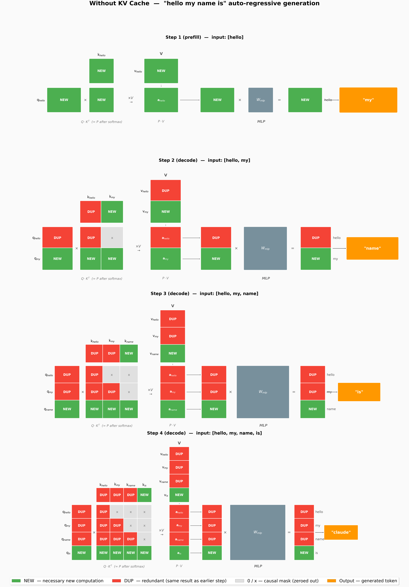
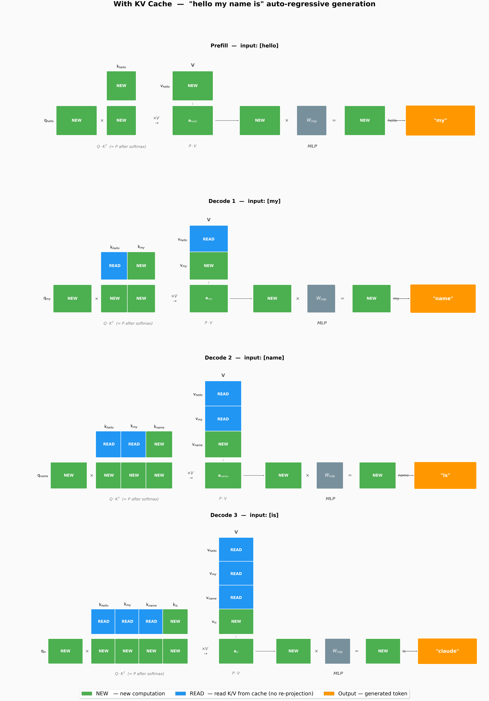

# KV Cache

## 问题：自回归生成的计算冗余

自回归生成的过程：输入 "hello"，模型预测 "my"；然后输入 "hello my"，预测 "name"；再输入 "hello my name"，预测 "is"……

```
Step 1: input=[hello]           → "my"
Step 2: input=[hello, my]       → "name"
Step 3: input=[hello, my, name] → "is"
Step 4: input=[hello, my, name, is] → "claude"
```

每个 Step 的前向传播包括：Q、K、V 投影 → 注意力计算 → MLP。但仔细想——Step 2 输入 "hello my" 时，"hello" 的 Q、K、V 投影和 Step 1 输入 "hello" 时**完全一样**。因为模型参数没变，"hello" 的 embedding 没变，投影结果自然不变。

**也就是说，我们每步都在重新计算上一步已经算过的内容。**

## 无 KV Cache 时到底有多浪费

下面 4 张图展现了没有 KV Cache 时的 4 步生成过程：

- **绿色 NEW**：这一步必须计算的内容（新 token 的投影 + 之后的注意力 + MLP）
- **红色 DUP**：与上一步完全重复的计算（历史 token 的投影）
- **灰色 ✗**：causal mask 屏蔽的位置（看不到未来）



聚焦 Step 3（第三行），input=[hello, my, name]：

- **Q 列**："hello" 和 "my" 的 Q 投影标记为 DUP——这两步在 Step 2 已经算过
- **K 行**（顶部）：同理，"hello" 和 "my" 的 K 投影也是 DUP
- **注意力矩阵**：只有最后一行（name 的 Q 去乘所有 K）是真正需要的 NEW 计算，上方的 "dup" 格子和 Step 2 的结果一模一样
- **V 列 + MLP**："hello" 和 "my" 的 V 投影和注意力输出也都是 DUP

**结论：序列长度 S 时，无 Cache 的每一步都在重算前 S-1 个 token 的 K、V 投影，以及整个三角注意力矩阵的上半部分。**

更定量地看：

| Step | 输入长度 | Q/K/V 投影量 | 注意力矩阵大小 |
|------|---------|-------------|--------------|
| 1    | 1       | 1 token     | 1×1          |
| 2    | 2       | 2 tokens    | 2×2          |
| 3    | 3       | 3 tokens    | 3×3          |
| 4    | 4       | 4 tokens    | 4×4          |
| **总计** | | **10 tokens** 的投影 | |

4 步生成 "my name is claude"，累积做了 10 个 token 的 Q/K/V 投影，但其中只有 4 个是真正"新"的。

## KV Cache 的核心思想

既然每个 token 的 **K 和 V 只依赖自己和之前的 token**（causal attention 看不到未来），那已经算过的 token，其 K、V **永远不变**。所以：

> **算过一次就存起来，下次直接用，不再重算。**

Q 不能缓存——Q 在每一层 Decoder Layer 中都是从当前 token 的 hidden state 投影来的，而 hidden state 的输入来自上一层（self-attention），会随着后续 token 的加入而变化。

K 和 V 可以缓存——它们只依赖当前层的输入 token，不受后续 token 影响。这正是 causal attention 的性质保证的。

## 有了 KV Cache 之后



流程变为 **1 次 Prefill + 多次 Decode**：

### Prefill（Step 1）

输入完整 prompt 做第一次前向，计算出所有 prompt token 的 K 和 V，**存入 KV Cache**。Prefill 和普通的 forward 没有本质区别，只是多加了一步"存进 cache"。

### Decode（Step 1/2/3）

每次 decode 只输入 **1 个新 token**（刚采样出来的），对于注意力计算：

- **Q**：只有当前 token 的 1 个 Q 向量，需要全新计算
- **K、V**：从这个 token 投影出 1 个新的 K/V，同时从 cache 读取**所有历史 token**的 K/V，拼在一起
- **注意力矩阵**：从 $S \times S$ 三角矩阵退化为 **$1 \times S$** 的单行——当前 token 的 Q 去乘所有 K

对比两张图的关键差异：

| | 无 KV Cache | 有 KV Cache |
|---|---|---|
| Step 3 Q 列 | 3 行（hello/my/name）| **1 行（name）** |
| Step 3 K 行 | 3 个全重算 | 2 个 READ + 1 个 NEW |
| Step 3 注意力矩阵 | 3×3 三角 | **1×3 单行** |
| DUP 标记 | 遍地都是 | **零 DUP** |

## 计算量对比

| 操作 | 无 Cache（4步累计） | 有 Cache | 节省 |
|------|-------------------|---------|------|
| Q Proj | 10 tokens | 7 tokens | -30% |
| K Proj | 10 tokens | 7 tokens | -30% |
| V Proj | 10 tokens | 7 tokens | -30% |
| Q·K^T | 10 | 10 | 0% |
| P·V | 10 tokens | 7 tokens | -30% |
| O Proj | 4 tokens | 4 | 0% |
| MLP | 10 tokens | 7 tokens | -30% |

**注意 Q·K^T 没有节省。** 虽然注意力矩阵从三角变成了单行，但计算量本质上是一样的：K 的 token 数（S）不变，每个 Q 还是要乘全部的 K。KV Cache 节省的是"不重复产生 K 和 V"，而不是"不重复算注意力矩阵乘法"。

## Prefill 与 Decode 的差异

KV Cache 将自回归生成拆成了两个截然不同的阶段。理解它们的差异是后续深入推理优化的关键。

### 一句话区分

| | Prefill | Decode |
|---|---|---|
| **干什么** | 一次处理整个 prompt | 逐个生成新 token |
| **输入** | 全部 prompt tokens | 1 个 token（上次采样结果）|
| **并行度** | 全部 token 并行计算 | token 间串行，token 内并行 |
| **Q 形状** | (B, S, hidden) | (B, 1, hidden) |
| **注意力矩阵** | S×S 三角 | 1×S 单行 |
| **瓶颈** | 计算密集 | 显存带宽密集 |
| **写 KV Cache** | 写入 S 个 token 的 K、V | 写入 1 个 token 的 K、V |

### 为什么瓶颈不同

**Prefill 是计算密集**：S 个 token 同时做 Q、K、V 投影和 MLP，大量的矩阵乘法可以利用 GPU 并行算力。S 越大，GPU 利用率越高，计算时间主导。

**Decode 是带宽密集**：输入只有 1 个 token，矩阵乘法的计算量很小，但需要从 HBM 读取**整个模型权重**（几十 GB）和**整个 KV Cache**（几 GB），只为产生 1 个 token。数据搬移时间远超计算时间，GPU 算力大量闲置。

```
Prefill:                         Decode:
                                 
  S 个 token 并行                 1 个 token
  Q/K/V/MLP 全算                  K/V 投影算 1 个
  大量矩阵乘法                     大量权重读取
  GPU 满负荷                     GPU 等待显存
  ┌──────────────┐              ┌──────────┐
  │ ██████████████│              │ ░░██░░░░░░│
  └──────────────┘              └──────────┘
  计算时间 >> 数据读取              数据读取 >> 计算时间
```

这也是为什么**长 prompt 处理很快，但逐 token 生成却很慢**——前者 2000 token 的 prefill 可能只需 50ms，而 2000 个 decode step 却要好几秒。

### 从 attention 看差异

同样是算 `Q × K^T × V`：

- **Prefill**：Q、K、V 都是 S×d 的矩阵，做完整的 S×S 注意力，同时在 S 维度高度并行，适合用 **FlashAttention** 分块加速
- **Decode**：Q 只有 1×d，K 和 V 是 S×d（历史全在 cache 里），注意力退化为向量内积 + 加权求和，FlashAttention 优化不明显

### 总结对比

| 维度 | Prefill | Decode |
|------|---------|--------|
| 输入长度 | S (prompt) | 1 (sampled token) |
| 输出长度 | 1 (first token) | 1 per step |
| 注意力 | S×S, 计算密集 | 1×S, 带宽密集 |
| KV Cache | 写入 | 写入 + 读取 |
| 优化方向 | 并行度、矩阵效率 | 显存带宽、KV cache 压缩 |
| 关键加速 | FlashAttention | PagedAttention, GQA, KV 量化 |
| 当 S=1 时 | Prefill = Decode | — |

关键洞察：**当 prompt 只有 1 个 token 时，Prefill 和 Decode 的计算量是一样的**。这也是为什么有些框架对短 prompt 直接跳过 Prefill 的单独处理。随着 S 增长，两个阶段的分化越来越明显，需要分别优化。

## 显存代价

KV Cache 中，**每一层 Decoder Layer 都要缓存自己的 K 和 V**，且 K、V 各占一份。总元素数为：

$$
\text{KV Cache 元素数} = 2 \times \text{num\_layers} \times \text{num\_kv\_heads} \times \text{head\_dim} \times \text{context\_len}
$$

其中因子 2 来自 **K 和 V 各一份**，`num_layers` 才是层数。显存换算：

$$
\text{KV Cache 大小} = \text{元素数} \times \text{dtype\_size}
$$

以 Qwen3-8B（num_layers=36, num_kv_heads=8, head_dim=128）为例：

- 1 token 的 KV cache：2 × 36 × 8 × 128 = **73,728 个元素** ≈ 147 KB (bfloat16)
- 2048 token 上下文 ≈ 300 MB
- 32K 上下文 ≈ 4.7 GB

KV Cache 以显存换速度，这在现代 GPU 上是划算的。

## 总结

KV Cache 是 LLM 推理的第一个核心优化。它利用了 causal attention 中"历史 token 不受未来影响"的性质，将 K、V 投影的计算量从 $O(S^2)$ 降到 $O(S)$。

但 KV Cache 也暴露了新的瓶颈：

1. **显存压力**：长序列时 cache 膨胀很快 → 催生了 PagedAttention（就像操作系统的分页内存管理）
2. **Q·K^T 仍然 O(S²)**：注意力矩阵乘法本身没有减少 → 催生了 FlashAttention（通过分块计算来加速）
3. **Prefill 受限于 prompt 长度**：长 prompt 的第一次前向仍然要算所有 token 的投影

这些优化会在后续课程展开。
