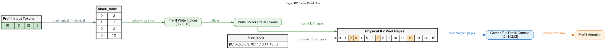
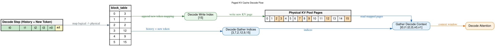

# Paged KV Cache

## 问题：KV Cache 的显存碎片

[07-kv-cache.md](07-kv-cache.md) 中我们讲到，KV Cache 需要在显存中为每个序列缓存所有层、所有 token 的 K 和 V。传统做法是**连续分配**——每个序列预留一大段连续显存。

```
传统连续分配：
序列 A: [████████░░░░░░░░░░░░]  预分配 max_len=16，实际用了 3
序列 B: [░░░░░░░░░░████████░░]  预分配 max_len=16，实际用了 4
序列 C: [░░░░░░░░░░░░░░░░████]  预分配 max_len=16，实际用了 4
               浪费 37 个位置！
```

三个问题：

1. **过度预分配**：不知道序列最终多长，必须按 max_len 预留，大部分用不上
2. **碎片化**：序列结束释放后留下各种大小的空洞，新的序列进来可能 "总空间够但装不下"(类似 4K 页的物理内存管理问题)
3. **无法共享**：并行 beam search 时多个候选序列的 prompt 相同，各自的 KV Cache 却要各存一份

## Paged KV Cache 的核心思想

来自 vLLM 的 PagedAttention 论文。借鉴操作系统**虚拟内存分页**的思路：

- 将 KV Cache 切分为固定大小的 **物理页**（比如每页存 16 个 token 的 KV）
- 每个序列的逻辑位置通过 **页表** 映射到物理页
- 物理页不连续也没关系，页表负责地址翻译

```
传统连续分配：                        Paged 分配：
序列: [t0][t1][t2][t3]               序列页表: 块0→页3, 块1→页7, 块2→页2, 块3→页12
      └───连续一段显存───┘             物理池: [0][1][2已用][3已用][4]...[7已用]...[12已用]...
                                         分散在物理池的不同位置，逻辑上连续
```

## Prefill 写入流程

下面这张图展示了 Paged KV Cache 在 Prefill 阶段的完整数据流：



从左到右 6 步：

### 1. Prefill Input Tokens（绿色）

4 个 prompt token t0, t1, t2, t3 到达。

### 2. block_table（页表分配）

```
逻辑块  →  物理页
  0     →    3
  1     →    7
  2     →    2
  3     →   12
```

从 free_slots（底部空闲页列表 `[0,1,4,5,6,8,9,10,11,13,14,15,...]`）中分配 4 个物理页给该序列，建立页表映射。**物理页互不相邻**（3, 7, 2, 12 散落各处），但逻辑块 0→1→2→3 是连续的。

### 3. Prefill Write Indices

从页表提取目标物理地址：`[3, 7, 2, 12]`。

### 4. Write KV for Prefill Tokens

将每个 prefill token 的各层 K、V 写入对应物理页。t0→页3，t1→页7，t2→页2，t3→页12。物理池中这 4 页被标记为已占用（橙色）。

### 5. Gather Full Prefill Context

注意力计算前，需要把所有 token 的 KV **按逻辑顺序拼好**：`[t0, t1, t2, t3]`。通过页表反查——逻辑块 0 在物理页 3，逻辑块 1 在物理页 7……gather 出连续的逻辑视图。

### 6. Prefill Attention

Gather 出的完整 context window 送入注意力计算。

## Decode 阶段

Prefill 完成后，prompt 的 KV 已在物理页中。Decode 时每次生成 1 个新 token，需要：**(1) 写入新 token 的 KV (2) 读出全部历史 KV 做注意力**。下图展示了一次 Decode step 的完整数据流：



### 场景设定

Prefill 已完成，页表已有 4 行映射（块0→页3, 块1→页7, 块2→页2, 块3→页12），存储了 t0-t3。已经 decode 了一轮生成了 n0（写入了页 9），这是第二轮 decode，当前新 token 为 n1（黄色高亮）。

### 1. Decode Step（最左，绿色 + 黄色）

逻辑视图：历史 token t0, t1, t2, t3（绿色）+ 已生成的 n0（绿色）+ 新 token n1（黄色）。历史 token 的 KV 全在物理页中，不需要重新计算 K/V 投影。

### 2. block_table — 追加新映射

```
逻辑块  →  物理页
  0     →    3      ← prefill 时期
  1     →    7
  2     →    2
  3     →   12
  4     →    9      ← 上一轮 decode 分配
  5     →   15      ← 本轮 decode 分配（新！）
```

n1 导致页 9 满了（假设每页 1 个 token），需要从 free_slots 分配新页 15，页表新增 `块5→页15`。

### 3. Decode Write Index

从页表提取新 token 要写入的物理页：`[15]`。只写 1 页——Decode 每次只产出 1 个 token。

### 4. Physical KV Pool Pages — 写入 + 读取

- **写入**（绿色箭头）：n1 的各层 KV 写入物理页 15（橙色 = 已占用）
- **读取**（蓝色箭头）：页表遍历所有逻辑块，得到物理地址 `[3, 7, 2, 12, 9, 15]`——这就是全部上下文

### 5. Decode Gather Indices

从页表提取全部上下文对应的物理地址：`[3, 7, 2, 12, 9, 15]`。注意和 Prefill 时的 `[3, 7, 2, 12]` 相比，多了 `[9, 15]`——这是 decode 阶段逐步追加的。

### 6. Gather Decode Context

按逻辑顺序 gather 出完整上下文：`[t0, t1, t2, t3, n0, n1]`。注意这里的 gather 不是把物理页的 KV 数据搬走——只是用页表做**逻辑到物理的地址翻译**，注意力 kernel 直接按页表索引去对应物理页读取 K/V。

### 7. Decode Attention

当前 token n1 的 Q 去乘 gather 出的全部 K，得到注意力权重，再加权求和 V。这就是典型的 1×S 单行注意力。

### Prefill vs Decode 流程对比

| | Prefill | Decode |
|---|---|---|
| 写入页数 | S 页（所有 prompt token） | 1 页（1 个 token） |
| 读取页数 | S 页 | S+gen 页（所有历史 + 已生成） |
| 页表操作 | 新建多行映射 | 可能追加 1 行（页满时） |
| Gather 量 | S 个地址 | S+gen 个地址 |
| 瓶颈 | 计算密集 | 带宽密集 + 页表查找 |

## 传统方式 vs Paged（回顾）

### 零碎片

物理页大小固定，任何序列用完了就还给 free_slots。新序列来直接取空闲页，不存在 "总空间 8GB 但最大连续段只有 2GB" 的问题。就像操作系统不会因为物理内存碎片化而无法分配——页表抹平了物理不连续。

### 按需分配

不再预分配 max_len，序列实际生成多少就分配多少页。一个生成 10 token 的回复和一个生成 5000 token 的回复，占用的页数自然不同。

### 共享 prompt KV

并行 beam search 或 speculative decoding 时，多个候选序列共享完全相同的 prompt。它们的页表前几行可以**指向相同的物理页**（只读），不必各自复制。

```
序列 A: 块0→页3(共享) → 块1→页7(共享) → 块2→页5(独有)
序列 B: 块0→页3(共享) → 块1→页7(共享) → 块2→页9(独有)
序列 C: 块0→页3(共享) → 块1→页7(共享) → 块2→页1(独有)

prompt KV 只存 1 份，3 个序列共享。省了 67% 的 prompt KV 显存。
```

## 总结

| | 传统连续分配 | Paged KV Cache |
|---|---|---|
| 分配方式 | 预分配 max_len | 按页按需分配 |
| 碎片 | 严重 | 零碎片 |
| 内存利用率 | ~20-40% | ~90%+ |
| 共享 prompt KV | 不支持 | 页表指向相同物理页 |
| 复杂度 | 简单 | 需要页表管理 |
| 额外开销 | 无 | 页表查找 + gather |

Paged KV Cache 本质是用**页表的间接寻址**，换取了**零碎片、按需分配、KV 共享**三个收益。每个 token 的 KV cache 写入和读取时多了一次页表查找，但这点开销相比碎片浪费的显存和吞吐损失完全可以忽略。

这就是 vLLM 能以远超 HuggingFace Transformers 的吞吐服务 LLM 的核心原因之一。
