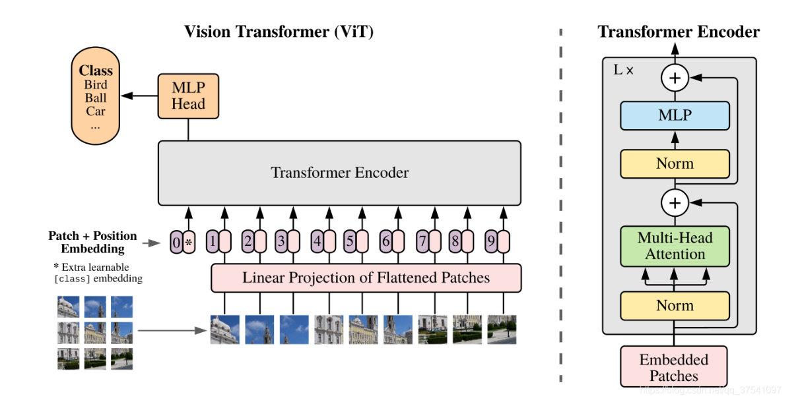
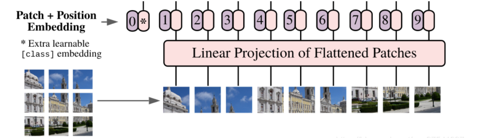
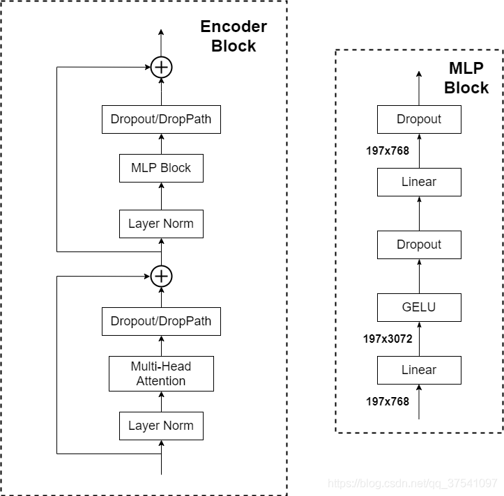

# ViT

下图是原论文中给出的 Vision Transformer 模型框架，模型由三个模块组成：

- **Linear Projection of Flattened Patches**（Embedding 层）
- **Transformer Encoder**
- **MLP Head**（分类层）



## 1. Patch Embedding

图像数据的格式为 `[H, W, C]` 三维矩阵，不是 Transformer 直接能处理的。需要先通过 Embedding 层做变换。

以 ViT-B/16 为例，将 224×224 的输入图片按 16×16 大小的 Patch 进行划分，得到 $(224/16)^2 = 196$ 个 Patches。每个 Patch 的 shape 为 `[16, 16, 3]`，通过线性映射得到一个长度为 768 的向量（后面统称为 token）。

在代码实现中，直接通过一个卷积层来实现：卷积核大小为 16×16，步距为 16，卷积核个数为 768。通过卷积 `[224, 224, 3] → [14, 14, 768]`，然后把 H、W 两个维度展平 `[14, 14, 768] → [196, 768]`，得到 Transformer 需要的二维矩阵。

## 2. Class Token 与 Position Embedding

在原论文中，向 tokens 中插入一个专门用于分类的 `[class]token`，它是一个可训练的参数，长度也是 768。

```
Cat([1, 768], [196, 768]) → [197, 768]
```

Position Embedding 就是之前 Transformer 中讲的位置编码，这里采用可训练参数（1D Pos. Emb.），直接叠加在 tokens 上，shape 同样是 `[197, 768]`。



## 3. Transformer Encoder

Transformer Encoder 由 Encoder Block 重复堆叠 L 次组成，每块包含：

- **Layer Norm**：针对每个 token 做归一化处理
- **Multi-Head Attention**：与标准 Transformer 中相同
- **Dropout / DropPath**
- **MLP Block**：全连接 + GELU 激活 + Dropout。第一个全连接层将节点数翻 4 倍 `[197, 768] → [197, 3072]`，第二个还原 `[197, 3072] → [197, 768]`



## 4. MLP Head

Transformer Encoder 的输入输出 shape 保持不变：输入 `[197, 768]`，输出也是 `[197, 768]`。只需提取 `[class]token` 对应的 `[1, 768]` 作为整张图的表示，再送入 MLP Head 得到分类结果。

原论文中在 ImageNet-21K 上训练时使用 `Linear + tanh + Linear`，迁移到 ImageNet-1K 时仅用一个 Linear 层。